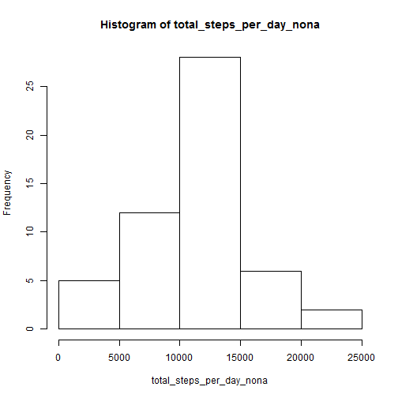
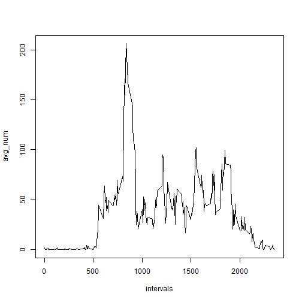
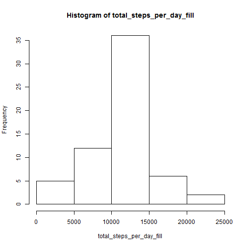
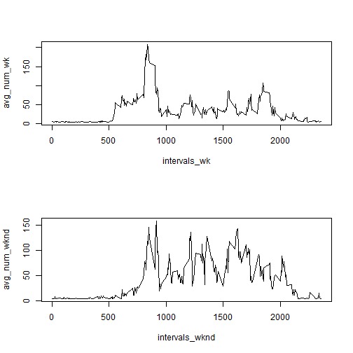

# Reproducible Research: Peer Assessment 1


## Loading and preprocessing the data

```r
setwd("D:/Coursera/DataScience/datasciencecoursera/RepData_PeerAssessment1")
rawdata<-read.csv("D:/Coursera/DataScience/datasciencecoursera/RepData_PeerAssessment1/activity.csv")
rawdata_nona<-na.omit(rawdata)
```
## What is mean total number of steps taken per day?

```r
options(scipen=999)
total_steps_per_day_nona<-tapply(rawdata_nona$steps, rawdata_nona$date, sum)
hist(total_steps_per_day_nona)
```

 

```r
summary_steps<-summary(total_steps_per_day_nona)
use_mean<-summary_steps[[4]]
use_median<-summary_steps[[3]]
```
The mean for total number of steps taken per day: 10770  
The median for total number of steps taken per day: 10760
## What is the average daily activity pattern?

```r
total_steps_across_day_nona<-tapply(rawdata_nona$steps, rawdata_nona$interval,mean)
intervals<-as.matrix(names(total_steps_across_day_nona))
avg_num<-data.matrix(total_steps_across_day_nona)
plot(intervals,avg_num,type = "l")
```

 

```r
max_avg<-max(avg_num)
max_interval<-intervals[avg_num==max_avg]
```
The max number of steps: 206.1698 at interval = 835

## Imputing missing values

```r
number_na<-sum(is.na(rawdata[,1]))
```
The total number of NAs: 2304  

Fill the NAs with mean of average number of steps taken

```r
rawdata_fill<-rawdata
rawdata_fill[is.na(rawdata[,1]),1]=mean(avg_num)
total_steps_per_day_fill<-tapply(rawdata_fill$steps, rawdata_fill$date, sum)
hist(total_steps_per_day_fill)
```

 

```r
summary_steps_fill<-summary(total_steps_per_day_fill)
use_mean_fill<-summary_steps_fill[[4]]
use_median_fill<-summary_steps_fill[[3]]
```
The mean for total number of steps for filled data taken per day: 10800  
The median for total number of steps for filled data taken per day: 10800
The mean and median appear to be different from the first version which excludes NAs
I filled the missing with the averge of average number of steps taken.  With this change, the mean and median appear to be the same.

## Are there differences in activity patterns between weekdays and weekends?

```r
#add one column specifying weekday or weekend
usedate<-as.Date(rawdata_fill[,2])
rawdata_fill[!(weekdays(usedate) %in% c('Saturday','Sunday')),4] = 'weekday'
rawdata_fill[(weekdays(usedate) %in% c('Saturday','Sunday')),4] = 'weekend'
#separate data for weekday and weekend
#weekday
names(rawdata_fill)[4]='Week'
rawdata_week<-rawdata_fill[rawdata_fill[,4]=='weekday',]
total_steps_across_day_weekday<-tapply(rawdata_week$steps, rawdata_week$interval,mean)
intervals_wk<-as.matrix(names(total_steps_across_day_weekday))
avg_num_wk<-data.matrix(total_steps_across_day_weekday)
#weekend
rawdata_wknd<-rawdata_fill[rawdata_fill[,4]=='weekend',]
total_steps_across_day_wknd<-tapply(rawdata_wknd$steps, rawdata_wknd$interval,mean)
intervals_wknd<-as.matrix(names(total_steps_across_day_wknd))
avg_num_wknd<-data.matrix(total_steps_across_day_wknd)
#plot
par(mfrow=c(2,1))
plot(intervals_wk,avg_num_wk,type = "l")
plot(intervals_wknd,avg_num_wknd,type = "l")
```

 

  
There are differences in activity pattern between weekdays and weekends.  During weekdays, the activity peaks around intervals = 800.  There are minimal activites in other time intervals.  During weekends, people tend to be more active throughout the day so the averge number of steps taken are more balanced.  
